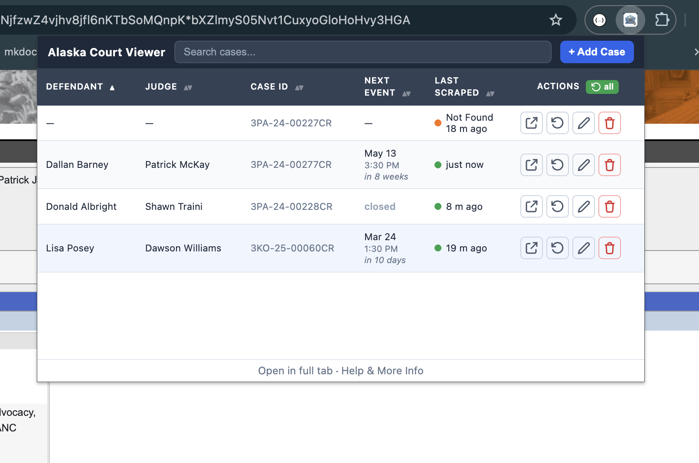

# Alaska Court Viewer

A Chrome extension for tracking and automatically looking up Alaska court case information.

Alaska Court Viewer helps you manage a list of court cases, automatically look up case details from the Alaska Court System's CourtView website, and view upcoming court dates in a sortable, searchable table -- all from your browser toolbar.

---

## Installation Instructions

1. Download the latest release .zip file from https://github.com/NickCrews/courtviewer/releases.
2. Unzip this to a folder that you won't accidentally delete late, eg `<Desktop>/alaska-court-viewer-1.0.0/`
2. Open Chrome and type `chrome://extensions/` in the address bar, then press Enter.
3. In the top-right corner of the page, enable **Developer mode** by clicking the toggle switch.
4. Click the **"Load unpacked"** button that appears.
5. In the file picker, select the unzipped folder.
6. The Alaska Court Viewer icon will appear in your Chrome toolbar.
7. *(Optional)* To keep the icon always visible, click the **puzzle piece** icon in the toolbar and click the **pin** icon next to "Alaska Court Viewer."

---

## How to Use

### Adding Cases

1. Click the Alaska Court Viewer icon in your Chrome toolbar. A popup window will appear.
2. Click **"Add Case."**
3. Enter the case number (for example, `3AN-24-00123CR`), the defendant name, and any notes you would like to save.
4. Click **Save.**

### Viewing Your Cases

- All of your cases are displayed in a table inside the popup.
- **Sort** by clicking any column header. Click the same header again to reverse the sort order.
- **Search** using the search bar to filter by defendant name, case ID, or notes.
- The **"Next Court Date"** column shows the next upcoming hearing date for each case.
- The **"Last Scraped"** column shows when the extension last looked up information for that case on CourtView.

### Looking Up Case Information

- Click **"Scrape"** next to any individual case to look up its latest information from CourtView and save it locally.
- Click **"Scrape All"** to look up all of your cases at once. The extension opens background tabs to check each case on the CourtView website.
- The extension will automatically navigate the CourtView website, search for the case, and extract the next court date.
- Results appear in the table once the lookup is complete.
- Click **"Open"** to open a live tab with the current case information directly from CourtView. This does not update your saved data.

### Editing and Deleting Cases

- Click **"Edit"** next to a case to change its defendant name or notes.
- Click **"Delete"** to remove a case. This also removes any scraped data that was saved for that case.

---

## Where Your Data is Stored

**This is important information about your data:**

- All case data (case numbers, defendant names, notes, and scraped court information) is stored **locally in your Chrome browser** using Chrome's built-in storage. Nothing is sent anywhere else.
- Your data **never leaves your computer.** It is not sent to any server, cloud service, or third party.
- Your data persists across browser restarts and computer reboots. You do not need to save manually.
- Your data is tied to your **Chrome profile.** If you use multiple Chrome profiles, each one has its own separate set of data.
- **Clearing Chrome's browsing data** (specifically the "Extensions" category) will delete your Court Viewer data.
- **Uninstalling the extension** will permanently delete all stored data.
- There is **no automatic backup.** Consider periodically writing down critical case information elsewhere as a safeguard.
- When you click **"Scrape"**, the extension saves the case details and next court date to your local storage. When you click **"Open"**, the extension accesses live data without saving it, allowing you to view the most current information.

---

## Troubleshooting

- **The extension icon does not appear in the toolbar.**
  Make sure Developer Mode is enabled on the `chrome://extensions/` page, and that you loaded the `dist` folder (not the top-level courtviewer folder).

- **No court date is showing for a case.**
  Some cases may not have upcoming events scheduled on CourtView. The extension displays a dash ("--") when no future court date is found.

- **My data seems to have disappeared.**
  Check that you are using the same Chrome profile you were using before. Data does not sync between different profiles or different devices.
